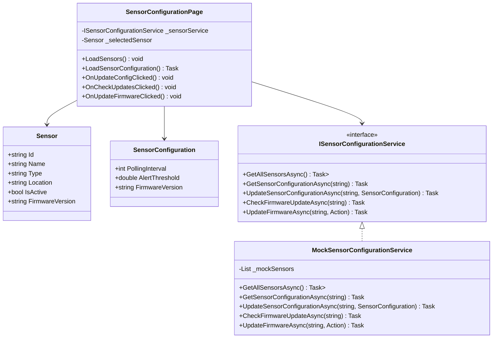
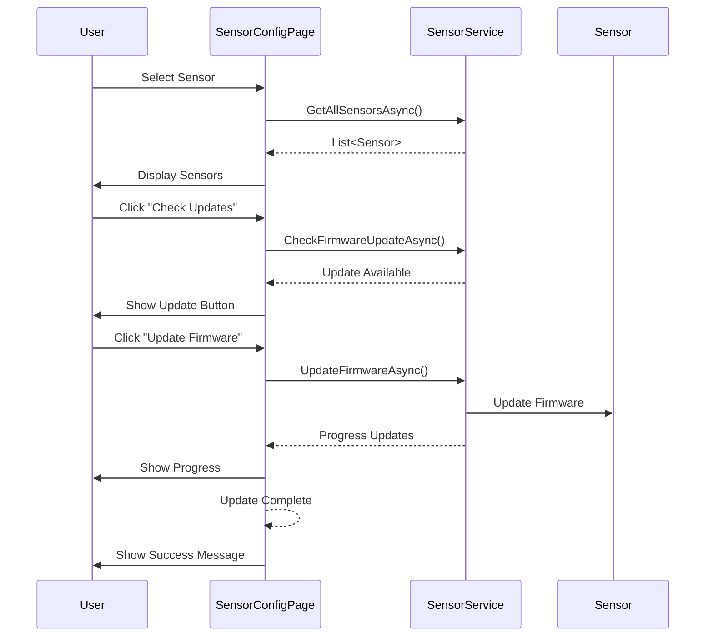

# Sensor Configuration UML Diagrams

## Class Diagram


## Sequence Diagram - Firmware Update


## Component Diagram
```mermaid
componentDiagram
    component "Sensor Configuration Module" {
        [SensorConfigurationPage]
        [ISensorConfigurationService]
        [MockSensorConfigurationService]
        [Sensor]
        [SensorConfiguration]
    }

    component "Testing" {
        [SensorConfigurationTests]
    }

    [SensorConfigurationPage] --> [ISensorConfigurationService]
    [MockSensorConfigurationService] --> [ISensorConfigurationService]
    [SensorConfigurationTests] --> [MockSensorConfigurationService]
``` 